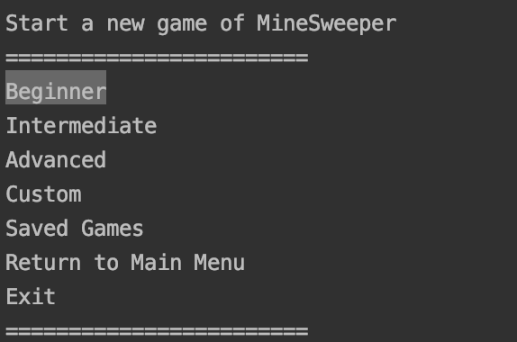
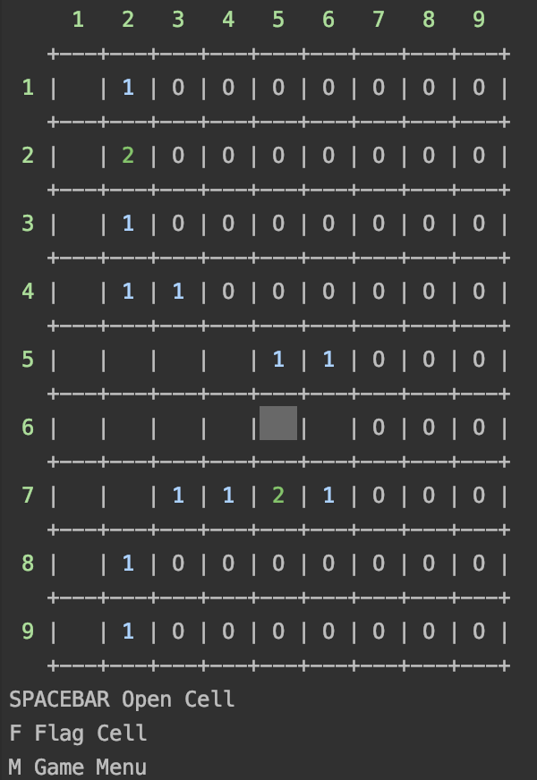
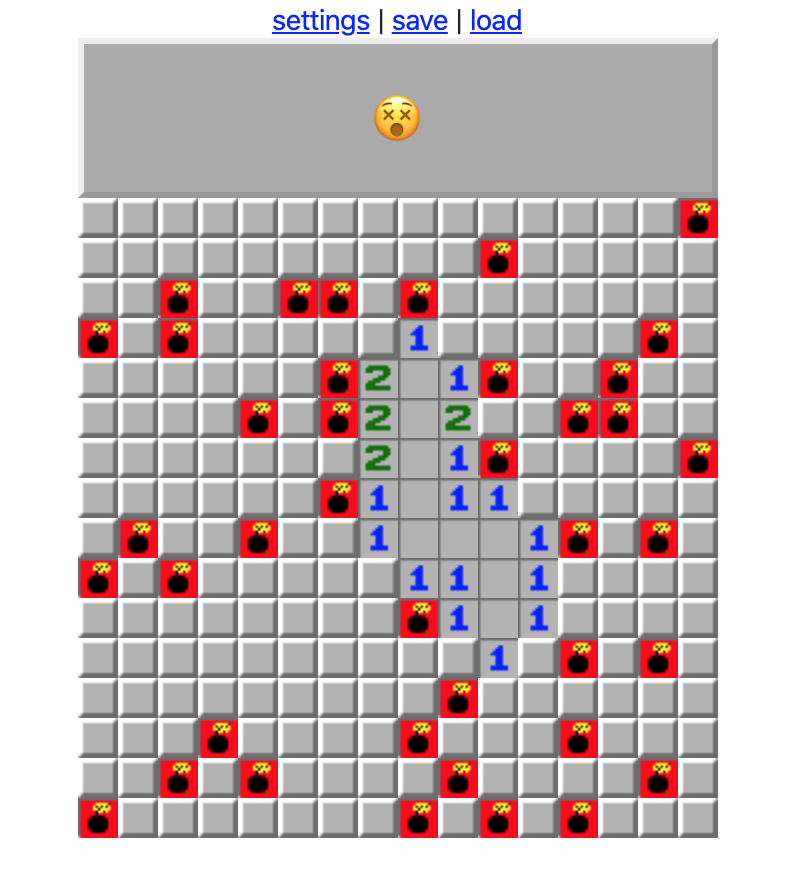
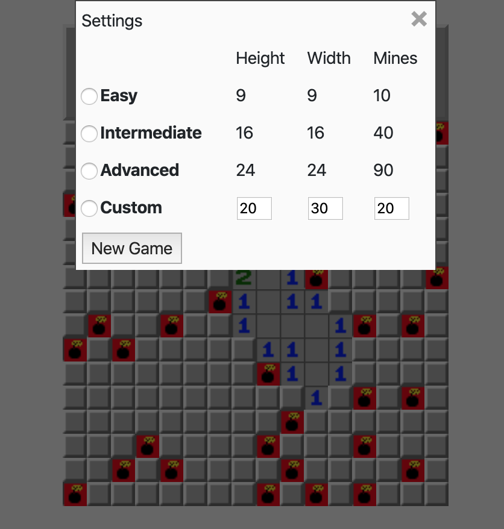

# MineSweeper

NB! Original repo was made in schools's private repo gitlab.cs.ttu and it is not possible to make it public there. 

The goal of this project was to familiarize with C# programming language and .NET tools.
- Console application was made on C#
- Web application was made in combination of vanilla javascript .NET Razor syntax
- Database to save and load games (possible to save in console app and continue game in web app and vice versa)

### Console application
 

### Web application

